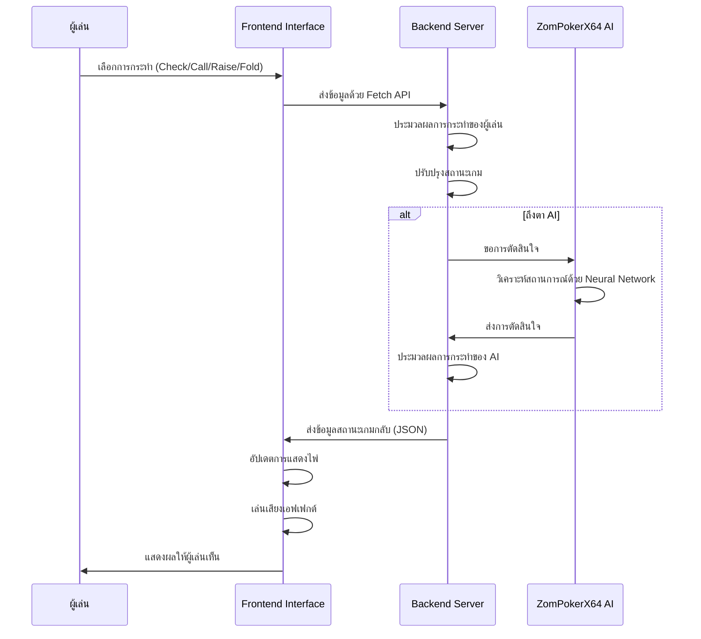
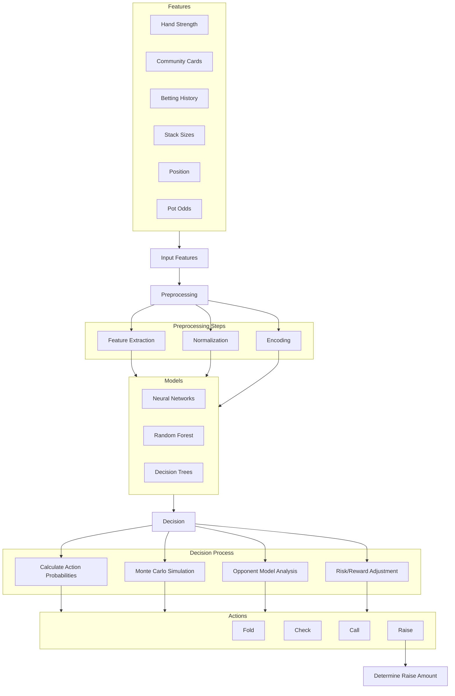

# PlantvsAi เกมกระดานที่มี AI หลายรูปแบบให้เล่นต่อสู้ด้วย

[](https://opensource.org/licenses/MIT)
[](https://www.python.org/downloads/)
[](https://flask.palletsprojects.com/)

## เกมที่มีให้เล่น

1. **Tic Tac Toe** - เกม XO แบบคลาสสิก
2. **Connect Four** - เกมต่อเรียง 4
3. **Checkers** - เกมหมากฮอส
4. **Chess** - เกมหมากรุกสากล
5. **Poker** - เกมไพ่โป๊กเกอร์

## อัลกอริทึม AI ที่ใช้

1. **Minimax with Alpha-Beta Pruning** - อัลกอริทึมการค้นหาแบบรอบด้านที่มีการตัดแขนงที่ไม่จำเป็น
2. **Pattern Recognition** - การจดจำรูปแบบการเล่นและตอบโต้ตามรูปแบบที่เคยพบ
3. **Q-Learning** - อัลกอริทึมการเรียนรู้แบบเสริมกำลัง (Reinforcement Learning)
4. **Neural Network** - การใช้เครือข่ายประสาทเทียมในการประเมินสถานการณ์
5. **MCTS (Monte Carlo Tree Search)** - การสุ่มจำลองเกมจำนวนมากเพื่อหาทางเล่นที่ดีที่สุด
6. **Genetic Algorithm** - อัลกอริทึมเชิงวิวัฒนาการที่ปรับปรุงกลยุทธ์ด้วยการสุ่มกลายพันธุ์และการคัดเลือก
7. **ZomPokerX64** - โมเดล AI ขั้นสูงสำหรับเกมโป๊กเกอร์ที่ใช้ Machine Learning และ Neural Networks

## โครงสร้างโปรเจค

```
tictactoe-zombitx64/
├── src/                    # โค้ดหลักของโปรเจค
├── tests/                  # การทดสอบ
├── docs/                   # เอกสารประกอบ
│   ├── api/                # เอกสาร API
│   ├── architecture/       # เอกสารสถาปัตยกรรม
│   └── user-guide/         # คู่มือการใช้งาน
├── static/                 # ไฟล์สถิต (CSS, JS, Images)
├── templates/              # เทมเพลต HTML
├── app.py                  # แอปพลิเคชัน Flask หลัก
├── .env.example            # ตัวอย่างไฟล์ environment variables
├── .gitignore              # ไฟล์ที่ git ควรเพิกเฉย
├── .editorconfig           # การกำหนดค่าสำหรับเครื่องมือแก้ไข
├── .pre-commit-config.yaml # การกำหนดค่า pre-commit hooks
├── CHANGELOG.md            # ประวัติการเปลี่ยนแปลง
├── CODE_OF_CONDUCT.md      # จรรยาบรรณของผู้มีส่วนร่วม
├── CONTRIBUTING.md         # คู่มือการมีส่วนร่วม
├── LICENSE                 # ข้อตกลงใบอนุญาต
├── Makefile                # คำสั่งทั่วไปสำหรับโปรเจค
├── pyproject.toml          # การกำหนดค่าโปรเจค Python
├── pytest.ini              # การกำหนดค่า pytest
├── README.md               # ไฟล์ README นี้
├── requirements.txt        # dependencies หลัก
├── requirements-dev.txt    # dependencies สำหรับการพัฒนา
└── setup.py                # สคริปต์การติดตั้ง
```

## การติดตั้ง

สามารถใช้ได้สองวิธี:

### วิธีที่ 1: ใช้ Makefile (แนะนำ)

```bash
# Clone repository
git clone https://github.com/yourusername/tictactoe-zombitx64.git
cd tictactoe-zombitx64

# ติดตั้งและตั้งค่าสภาพแวดล้อม
make setup

# เปิดใช้งานสภาพแวดล้อมเสมือน
# สำหรับ Unix/MacOS:
source venv/bin/activate
# สำหรับ Windows:
venv\Scripts\activate

# รันเซิร์ฟเวอร์
make server
```

### วิธีที่ 2: ใช้คำสั่ง Python

```bash
# Clone repository
git clone https://github.com/yourusername/tictactoe-zombitx64.git
cd tictactoe-zombitx64

# สร้างสภาพแวดล้อมเสมือน
python -m venv venv
source venv/bin/activate  # สำหรับ Unix/MacOS
venv\Scripts\activate  # สำหรับ Windows

# ติดตั้ง dependencies
pip install -r requirements.txt

# รันแอปพลิเคชัน
python app.py
```

จากนั้นเข้าไปที่ http://localhost:5000 ในเว็บเบราว์เซอร์เพื่อเริ่มเล่นเกม

## คำสั่งที่มีประโยชน์

โปรเจคนี้มาพร้อมกับ Makefile ที่มีคำสั่งที่มีประโยชน์หลายอย่าง:

- `make setup` - ตั้งค่าสภาพแวดล้อมการพัฒนา
- `make test` - รันการทดสอบทั้งหมด
- `make lint` - ตรวจสอบรูปแบบโค้ด
- `make format` - จัดรูปแบบโค้ดโดยอัตโนมัติ
- `make docs` - สร้างเอกสาร
- `make server` - รันเซิร์ฟเวอร์การพัฒนา

รันคำสั่ง `make help` เพื่อดูรายการคำสั่งที่มีทั้งหมด

## การใช้งาน

1. เลือกเกมที่ต้องการเล่นจากหน้าหลัก
2. เลือกอัลกอริทึม AI ที่ต้องการเล่นด้วย
3. เล่นเกมตามกติกาของแต่ละเกม
4. สถิติการเล่นจะถูกบันทึกไว้และแสดงผลในหน้าเกม

## เอกสาร

เอกสารเพิ่มเติมสามารถพบได้ในโฟลเดอร์ `docs/`:

- **API Documentation**: อธิบายเกี่ยวกับ API ที่มีให้ใช้
- **Architecture Documentation**: อธิบายสถาปัตยกรรมของระบบ
- **User Guide**: คู่มือผู้ใช้โดยละเอียด

คุณสามารถสร้างเอกสาร HTML ได้โดยใช้คำสั่ง:

```bash
make docs
```

# เกมโป๊กเกอร์ (Poker Game)

เกมโป๊กเกอร์ที่พัฒนาด้วย Python โดยใช้แนวคิด Texas Hold'em Poker พร้อม AI ขั้นสูงจากโมเดล ZomPokerX64

## คุณสมบัติ

- เล่นโป๊กเกอร์แบบ Texas Hold'em
- ระบบเว็บเซิร์ฟเวอร์ด้วย Flask
- เชื่อมต่อ frontend กับ backend ด้วย Fetch API
- แสดงผลไพ่ด้วยภาพจาก SVG
- ระบบเสียงเอฟเฟกต์ที่สมจริง
- มี AI หลายระดับความยาก:
  - AI แบบง่าย (Rule-based AI)
  - AI แบบใช้ความน่าจะเป็น (Probability-based AI)
  - **AI ขั้นสูง ZomPokerX64 (Machine Learning & Neural Networks)**
- ระบบเก็บสถิติการเล่น
- ระบบเดิมพันและจัดการชิป
- แสดงผลลัพธ์แบบละเอียด

## วิธีการเล่น

1. เข้าไปที่ http://localhost:5000 ในเว็บเบราว์เซอร์
2. เลือกเกม Poker จากหน้าหลัก
3. เลือกระดับความยากของ AI
4. เล่นเกมโดยการเลือกการกระทำในแต่ละรอบ:
   - Check: ตรวจสอบ (เมื่อไม่มีการเดิมพันก่อนหน้า)
   - Call: เรียก (เมื่อมีการเดิมพันก่อนหน้า)
   - Raise: เพิ่มเดิมพัน
   - Fold: พับ

## AI ขั้นสูง ZomPokerX64

ZomPokerX64 เป็นโมเดล AI ขั้นสูงที่พัฒนาโดยใช้ Machine Learning และ Neural Networks เพื่อตัดสินใจในเกมโป๊กเกอร์ได้อย่างชาญฉลาด โดยมีคุณสมบัติดังนี้:

- **Pre-calculated hand strength tables**: ใช้ตารางความแข็งแกร่งของไพ่ที่คำนวณไว้ล่วงหน้า
- **Neural network for decision making**: ใช้ Neural Networks ในการตัดสินใจ
- **Opponent modeling**: วิเคราะห์รูปแบบการเล่นของคู่ต่อสู้
- **Monte Carlo simulations**: ใช้การจำลอง Monte Carlo เพื่อคำนวณโอกาสในการชนะ
- **Adaptive betting patterns**: ปรับรูปแบบการเดิมพันให้เหมาะสมกับสถานการณ์

รองรับการทำงานบนหลาย framework:
- TensorFlow
- scikit-learn
- SafeTensors

## Workflow Diagram ของเกม Poker

```mermaid
graph TD
    A[Poker Game Flow] --> B[เริ่มเกม]
    A --> C[Game Loop]
    A --> D[AI Decision]
    A --> E[Frontend-Backend]
    
    B --> B1[จัดการชิป]
    B --> B2[แจกไพ่]
    B --> B3[กำหนดผู้เล่นเริ่มต้น]
    
    C --> C1[Pre-Flop]
    C1 --> C1a[Small Blind]
    C1 --> C1b[Big Blind]
    C1 --> C1c[การเดิมพัน]
    
    C --> C2[Flop]
    C2 --> C2a[การเดิมพัน]
    
    C --> C3[Turn]
    C3 --> C3a[การเดิมพัน]
    
    C --> C4[River]
    C4 --> C4a[การเดิมพัน]
    
    C --> C5[Showdown]
    C5 --> C5a[คำนวณผู้ชนะ]
    C5 --> C5b[จ่ายชิป]
    
    D --> D1[ZomPokerX64 AI]
    D1 --> D1a[Neural Networks]
    D1 --> D1b[ข้อมูลสถานะเกม]
    D1 --> D1c[Monte Carlo Simulation]
    D1 --> D1d[Opponent Modeling]
    
    D --> D2[Rule-based AI]
    D2 --> D2a[กฎพื้นฐาน]
    D2 --> D2b[Hand Strength]
    D2 --> D2c[Pot Odds]
    D2 --> D2d[Position]
    
    D --> D3[Actions]
    D3 --> D3a[Fold]
    D3 --> D3b[Check]
    D3 --> D3c[Call]
    D3 --> D3d[Raise]
    
    E --> E1[Frontend JavaScript]
    E1 --> E1a[แสดงผลไพ่]
    E1 --> E1b[เสียงเอฟเฟกต์]
    E1 --> E1c[UI Controls]
    
    E --> E2[Backend Flask]
    E2 --> E2a[Game Logic]
    E2 --> E2b[AI]
    E2 --> E2c[State Management]
    
    E --> E3[API]
    E3 --> E3a[AJAX/Fetch]
    E3 --> E3b[WebSocket]
    E3 --> E3c[JSON Responses]
```



## การทำงานของระบบ

### Frontend-Backend Communication Flow



### ZomPokerX64 AI Architecture



## การมีส่วนร่วมในโปรเจค

เรายินดีต้อนรับการมีส่วนร่วมจากทุกคน! โปรดดูที่ [CONTRIBUTING.md](CONTRIBUTING.md) สำหรับรายละเอียดเกี่ยวกับวิธีการมีส่วนร่วม

## จรรยาบรรณ

โปรเจคนี้อยู่ภายใต้ [Code of Conduct](CODE_OF_CONDUCT.md) ทุกคนที่มีส่วนร่วมถูกคาดหวังให้ปฏิบัติตามข้อกำหนดเหล่านี้

## ประวัติการเปลี่ยนแปลง

ดูการเปลี่ยนแปลงทั้งหมดของโปรเจคได้ที่ [CHANGELOG.md](CHANGELOG.md)

## ใบอนุญาต

โปรเจคนี้อยู่ภายใต้ใบอนุญาต MIT - ดูไฟล์ [LICENSE](LICENSE) สำหรับรายละเอียด
