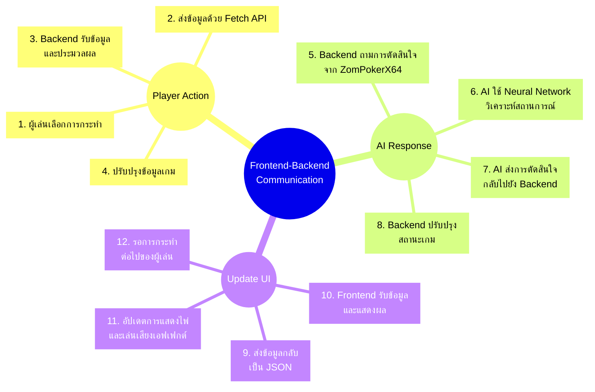
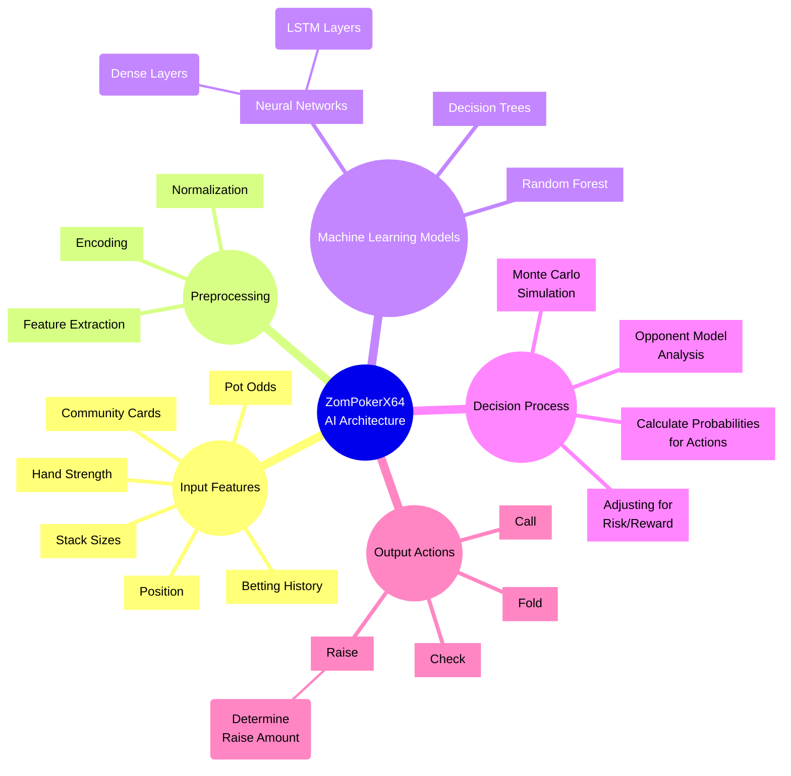

# Tictactoe-zombitx64

เกมกระดานที่มี AI หลายรูปแบบให้เล่นต่อสู้ด้วย

## เกมที่มีให้เล่น

1. **Tic Tac Toe** - เกม XO แบบคลาสสิก
2. **Connect Four** - เกมต่อเรียง 4
3. **Checkers** - เกมหมากฮอส
4. **Chess** - เกมหมากรุกสากล
5. **Poker** - เกมไพ่โป๊กเกอร์

## อัลกอริทึม AI ที่ใช้

1. **Minimax with Alpha-Beta Pruning** - อัลกอริทึมการค้นหาแบบรอบด้านที่มีการตัดแขนงที่ไม่จำเป็น
2. **Pattern Recognition** - การจดจำรูปแบบการเล่นและตอบโต้ตามรูปแบบที่เคยพบ
3. **Q-Learning** - อัลกอริทึมการเรียนรู้แบบเสริมกำลัง (Reinforcement Learning)
4. **Neural Network** - การใช้เครือข่ายประสาทเทียมในการประเมินสถานการณ์
5. **MCTS (Monte Carlo Tree Search)** - การสุ่มจำลองเกมจำนวนมากเพื่อหาทางเล่นที่ดีที่สุด
6. **Genetic Algorithm** - อัลกอริทึมเชิงวิวัฒนาการที่ปรับปรุงกลยุทธ์ด้วยการสุ่มกลายพันธุ์และการคัดเลือก
7. **ZomPokerX64** - โมเดล AI ขั้นสูงสำหรับเกมโป๊กเกอร์ที่ใช้ Machine Learning และ Neural Networks

## การติดตั้ง

```bash
# Clone repository
git clone https://github.com/yourusername/tictactoe-zombitx64.git
cd tictactoe-zombitx64

# สร้างสภาพแวดล้อมเสมือน
python -m venv venv
source venv/bin/activate  # สำหรับ Unix/MacOS
venv\Scripts\activate  # สำหรับ Windows

# ติดตั้ง dependencies
pip install -r requirements.txt

# รันแอปพลิเคชัน
python app.py
```

จากนั้นเข้าไปที่ http://localhost:5000 ในเว็บเบราว์เซอร์เพื่อเริ่มเล่นเกม

## การใช้งาน

1. เลือกเกมที่ต้องการเล่นจากหน้าหลัก
2. เลือกอัลกอริทึม AI ที่ต้องการเล่นด้วย
3. เล่นเกมตามกติกาของแต่ละเกม
4. สถิติการเล่นจะถูกบันทึกไว้และแสดงผลในหน้าเกม

# เกมโป๊กเกอร์ (Poker Game)

เกมโป๊กเกอร์ที่พัฒนาด้วย Python โดยใช้แนวคิด Texas Hold'em Poker พร้อม AI ขั้นสูงจากโมเดล ZomPokerX64

## คุณสมบัติ

- เล่นโป๊กเกอร์แบบ Texas Hold'em
- ระบบเว็บเซิร์ฟเวอร์ด้วย Flask
- เชื่อมต่อ frontend กับ backend ด้วย Fetch API
- แสดงผลไพ่ด้วยภาพจาก SVG
- ระบบเสียงเอฟเฟกต์ที่สมจริง
- มี AI หลายระดับความยาก:
  - AI แบบง่าย (Rule-based AI)
  - AI แบบใช้ความน่าจะเป็น (Probability-based AI)
  - **AI ขั้นสูง ZomPokerX64 (Machine Learning & Neural Networks)**
- ระบบเก็บสถิติการเล่น
- ระบบเดิมพันและจัดการชิป
- แสดงผลลัพธ์แบบละเอียด

## วิธีการเล่น

1. เข้าไปที่ http://localhost:5000 ในเว็บเบราว์เซอร์
2. เลือกเกม Poker จากหน้าหลัก
3. เลือกระดับความยากของ AI
4. เล่นเกมโดยการเลือกการกระทำในแต่ละรอบ:
   - Check: ตรวจสอบ (เมื่อไม่มีการเดิมพันก่อนหน้า)
   - Call: เรียก (เมื่อมีการเดิมพันก่อนหน้า)
   - Raise: เพิ่มเดิมพัน
   - Fold: พับ

## AI ขั้นสูง ZomPokerX64

ZomPokerX64 เป็นโมเดล AI ขั้นสูงที่พัฒนาโดยใช้ Machine Learning และ Neural Networks เพื่อตัดสินใจในเกมโป๊กเกอร์ได้อย่างชาญฉลาด โดยมีคุณสมบัติดังนี้:

- **Pre-calculated hand strength tables**: ใช้ตารางความแข็งแกร่งของไพ่ที่คำนวณไว้ล่วงหน้า
- **Neural network for decision making**: ใช้ Neural Networks ในการตัดสินใจ
- **Opponent modeling**: วิเคราะห์รูปแบบการเล่นของคู่ต่อสู้
- **Monte Carlo simulations**: ใช้การจำลอง Monte Carlo เพื่อคำนวณโอกาสในการชนะ
- **Adaptive betting patterns**: ปรับรูปแบบการเดิมพันให้เหมาะสมกับสถานการณ์

รองรับการทำงานบนหลาย framework:
- TensorFlow
- scikit-learn
- SafeTensors

## Workflow Diagram ของเกม Poker

```mermaid
mindmap
  root((Poker Game Flow))
    ((เริ่มเกม))
      [จัดการชิป]
      [แจกไพ่]
      [กำหนดผู้เล่นเริ่มต้น]
    ((Gameplay Loop))
      [Pre-Flop<br>ไพ่ในมือ)]
        (Small Blind)
        (Big Blind)
        (การเดิมพัน)
      [Flop<br>ไพ่กลาง 3 ใบ]
        (การเดิมพัน)
      [Turn<br>ไพ่กลางใบที่ 4]
        (การเดิมพัน)
      [River<br>ไพ่กลางใบที่ 5]
        (การเดิมพัน)
      [Showdown<br>เปิดไพ่]
        (คำนวณผู้ชนะ)
        (จ่ายชิป)
    ((AI Decision Making))
      [ZomPokerX64 AI]
        (Neural Networks)
        (ข้อมูลสถานะเกม)
        (Monte Carlo Simulation)
        (Opponent Modeling)
      [Rule-based AI]
        (กฎพื้นฐาน)
        (Hand Strength)
        (Pot Odds)
        (Position)
      [Actions]
        (Fold)
        (Check)
        (Call)
        (Raise)
    ((การสื่อสาร Frontend-Backend))
      [Frontend<br>JavaScript]
        (แสดงผลไพ่)
        (เสียงเอฟเฟกต์)
        (UI Controls)
      [Backend<br>Flask]
        (Game Logic)
        (AI)
        (State Management)
      [API]
        (AJAX/Fetch)
        (WebSocket)
        (JSON Responses)
```

## การทำงานของระบบ

### Frontend-Backend Communication Flow



### ZomPokerX64 AI Architecture



## License

MIT
