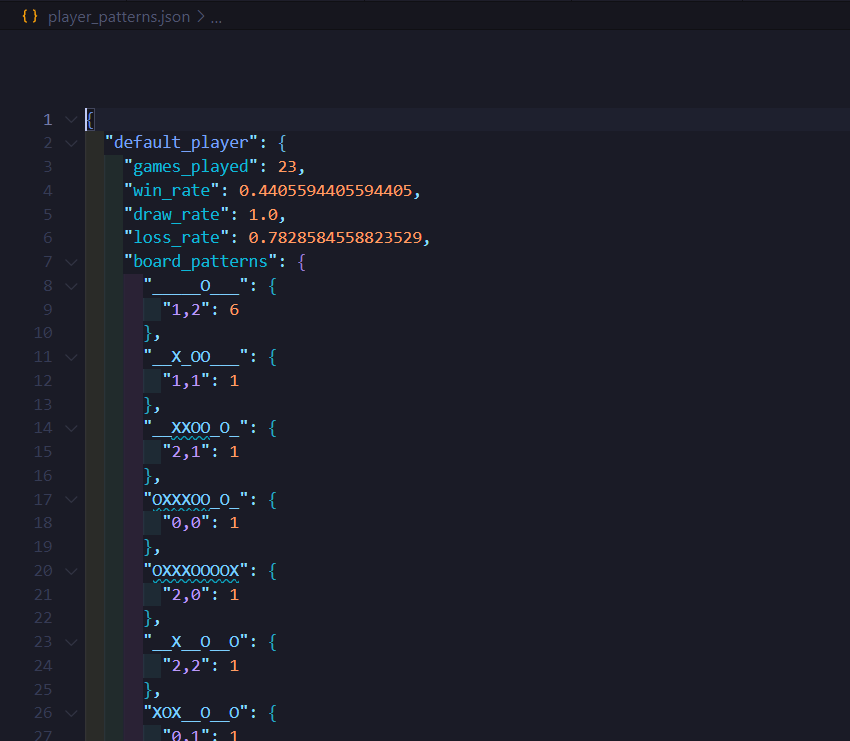
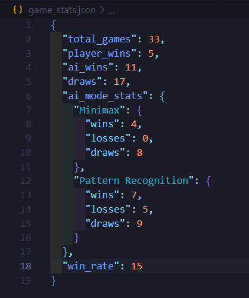

# Tictactoe-zombitx64

A Tic-tac-toe game with multiple AI opponent strategies implemented in both desktop (Pygame) and web application versions.

## Video

[](https://www.youtube.com/watch?v=L88agPTTn9M)

## Features

- Interactive 3x3 Tic-tac-toe board
- Player vs AI gameplay 
- Two different AI strategies:
  1. **Minimax Algorithm**: Traditional unbeatable algorithm
  2. **Pattern Recognition**: Analyzes and adapts to player patterns
- Game statistics tracking
- Real-time performance analysis
- Strategy switching during gameplay
- Modern user interface

## Static





## System Architecture

### Desktop Version Architecture
```
+------------------+     +-------------------+     +------------------+
|                  |     |                   |     |                  |
|   User Input     +---->+   Game Logic      +---->+   Pygame UI     |
|   (Mouse/Kbd)    |     |   (tictactoe.py)  |     |   Rendering     |
|                  |     |                   |     |                  |
+------------------+     +---------+---------+     +------------------+
                                   |
                                   v
                         +---------+---------+
                         |                   |
                         |   AI Strategies   |
                         |   - Minimax       |
                         |   - Pattern Rec.  |
                         |                   |
                         +---------+---------+
                                   |
                                   v
                         +---------+---------+
                         |                   |
                         |   Game Stats &    |
                         |   Pattern Storage |
                         |   (JSON Files)    |
                         |                   |
                         +-------------------+
```

### Web Version Architecture
```
  Client (Browser)                            Server (Flask)
+------------------+     HTTP     +---------------------------+
|                  |  Requests/   |                           |
|  HTML/CSS/JS     +------------->+  Flask Web Server         |
|  (frontend)      |  Responses   |  (app.py)                 |
|                  |<-------------+                           |
+-------+----------+              +-------------+-------------+
        |                                       |
        | User                                  |
        | Interaction                           |
        v                                       v
+-------+----------+              +-------------+-------------+
|                  |     API      |                           |
|  JavaScript      +------------->+  Game Logic &             |
|  Game Controller |  Endpoints   |  AI Strategy Controller   |
|                  |<-------------+                           |
+------------------+              +-------------+-------------+
                                              |
                                              |
                                              v
                                  +-----------+------------+
                                  |                        |
                                  |  Game Stats & Pattern  |
                                  |  Storage (JSON Files)  |
                                  |                        |
                                  +------------------------+
```

## Game Workflow

### Desktop Version Workflow
1. **Game Initialization**:
   - Load game settings and previous statistics
   - Initialize Pygame environment
   - Display welcome screen

2. **Game Loop**:
   - Handle player input (mouse clicks)
   - Process game logic (check valid moves, win conditions)
   - Execute AI move using selected strategy
   - Update game state
   - Render updated game board
   - Check for game completion

3. **Game Completion**:
   - Display result (win, lose, draw)
   - Update statistics
   - Save patterns for pattern recognition AI
   - Offer restart options

### Web Version Workflow
1. **Client Initialization**:
   - Load HTML/CSS/JS resources
   - Display welcome screen with game statistics

2. **Game Start**:
   - User selects AI strategy
   - Client sends request to start new game
   - Server initializes game state and responds
   - Client renders initial game board

3. **Game Loop**:
   - User clicks on cell
   - Client sends move to server via API
   - Server validates move, updates board, and executes AI move
   - Server checks for game completion
   - Server responds with updated game state
   - Client updates UI based on response
   - If game is over, automatically display results

4. **Game Completion**:
   - Display result overlay (win, lose, draw)
   - Server updates statistics
   - Server saves patterns for pattern recognition AI
   - Offer options to play again or return to menu

## Desktop Version

### How to Play

1. Install the required packages:
   ```
   pip install -r requirements.txt
   ```

2. Run the game:
   ```
   python tictactoe.py
   ```

3. Game Controls:
   - Click on a square to place an 'O'
   - AI will automatically place 'X' after your move
   - Click on the AI strategy buttons at the bottom to change AI opponents
   - Press 'r' to restart the game

## Web Application Version

### How to Run

1. Install the required packages:
   ```
   pip install -r requirements.txt
   ```

2. Run the Flask web server:
   ```
   python app.py
   ```

3. Open your web browser and navigate to:
   ```
   http://127.0.0.1:5000
   ```

### Features of the Web Version

- Responsive design that works on desktop and mobile devices
- Modern UI with smooth animations and transitions
- Game statistics saved between sessions
- Pattern recognition AI that learns from your play style
- Ability to toggle between AI strategies during gameplay
- Automatic display of game results when game ends

### How to Play (Web Version)

1. Select an AI mode on the welcome screen
2. Click "Start Game" to begin
3. Click on a cell to place your 'O' mark
4. AI will automatically respond with an 'X'
5. When the game ends, results will automatically display
6. Click "Play Again" or press 'R' to start a new game
7. Click "Menu" or press 'ESC' to return to the welcome screen

## AI Approaches

### Minimax Algorithm
The classic approach that recursively searches through all possible game states to determine the optimal move, always resulting in a draw or AI win if played optimally.

### Pattern Recognition
- Analyzes and records player move patterns
- Builds a database of strategies and counter-responses
- Adapts to individual player styles

## Technical Details

The game demonstrates multiple AI concepts:
- Game theory and decision trees (Minimax)
- Pattern recognition and adaptive learning

Game statistics and AI model data are saved between sessions for continuous learning.

## Data Flow

```
+------------------+           +------------------+           +------------------+
|                  |  Player   |                  |    AI     |                  |
|    Player        +---------->+    Game Board    +---------->+    AI System     |
|    Input         |   Move    |    State         |  Strategy |    Logic         |
|                  |           |                  |           |                  |
+------------------+           +--+---+-----------+           +--------+---------+
                                  |   ^                                |
                                  |   |                                |
                                  v   |                                v
                               +--+---+-----------+           +--------+---------+
                               |                  |           |                  |
                               |    Game Logic    |<----------+    AI Move      |
                               |    Controller    |           |    Generator     |
                               |                  |           |                  |
                               +------------------+           +------------------+
                                        |
                                        |
                                        v
                               +------------------+
                               |                  |
                               |    Statistics    |
                               |    & Storage     |
                               |                  |
                               +------------------+
```

## Technology Stack

### Desktop Version
- Python
- Pygame

### Web Version
- Backend: Python, Flask
- Frontend: HTML5, CSS3, JavaScript
- Data Storage: JSON files